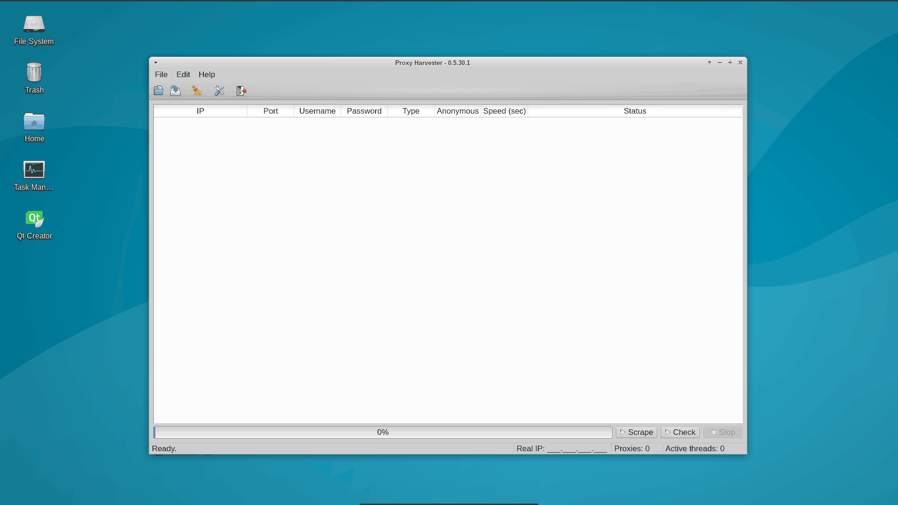

# Proxy Harvester

### About

PyQt5 multithreaded application for scraping and checking proxies. **Notice**: work in progress.

### Screenshot



### Requirements

Application is tested with python 3.5.2 version.

##### Aditional Python Libraries

- [lxml](https://github.com/lxml/lxml/)
- [requests](https://github.com/kennethreitz/requests)
- [PyQt5](https://github.com/baoboa/pyqt5)

### Installation

```
git clone https://github.com/fuzzy69/proxy-harvester.git
cd proxy-harvester/
virtualenv -p /usr/bin/python3 env
. env/bin/activate
pip install -r requirements.txt
```

### Usage

```
python main.py
```